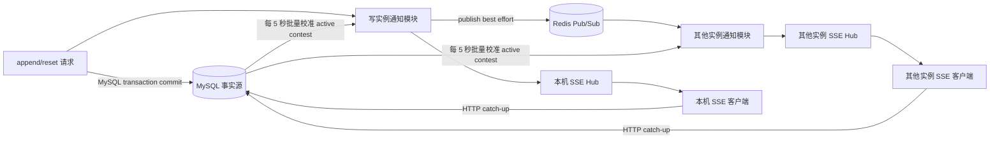
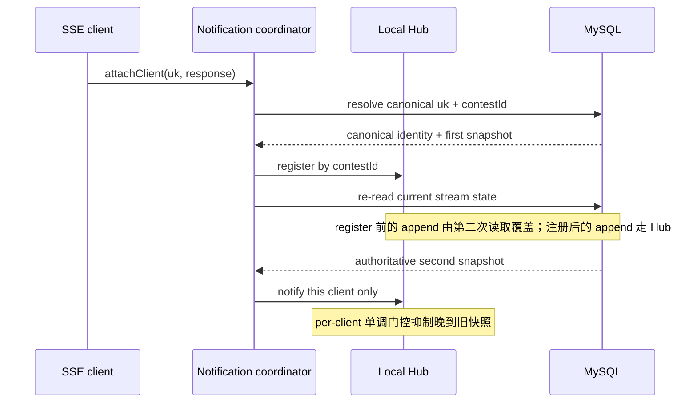
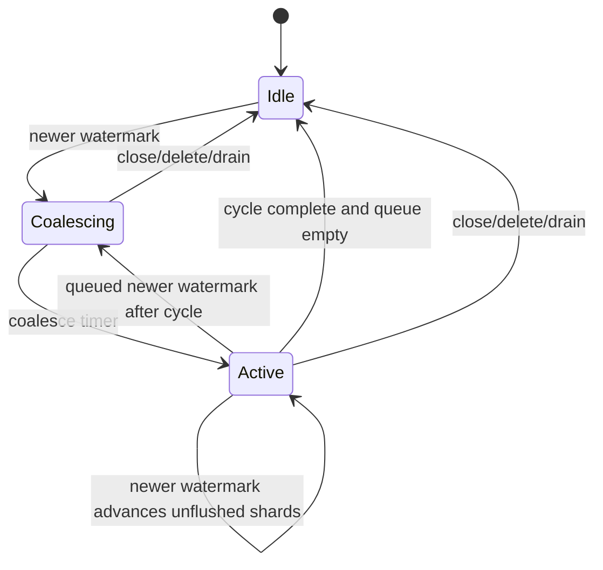

# 比赛事件可用通知多实例设计

状态：已确认设计

日期：2026-07-16

本文定义 RankLand v2 比赛事件可用通知在单进程、多进程和多机部署下的统一行为。

## 1. 范围

本设计覆盖：

- `GET /api/v2/public/contests/:uk/event-stream/notifications` 的服务端 SSE 连接管理；
- append/reset 提交后的本机与跨实例事件可用通知；
- Redis Pub/Sub 故障时的 MySQL 权威状态校准；
- SSE heartbeat、慢连接、反向代理和优雅退出；
- 多端口、多进程和共享 MySQL/Redis 的多机部署。

本设计不覆盖：

- 旧 `/live/:id` 轮询或 WebSocket 的迁移；
- 仓库前端的 `EventSource` 接入；
- 比赛时钟同步；
- Redis Sentinel/Cluster 接入；
- 事件 payload 的消息队列交付。

## 2. 现状与问题

当前正确性链路已经分层：MySQL 保存比赛事件和高水位，HTTP catch-up 返回真实事件，SSE 只提示 `{uk, latestEventId, streamRevision}`。这个分层应保留。

当前 `ContestSseHub` 只在进程内保存连接，append/reset 提交后也只调用本进程 Hub。因此在 nginx 把写请求和 SSE 连接分配到不同实例时，远端实例不会被即时唤醒。此外还有四个单实例问题：

1. SSE 路由先读 MySQL 再注册连接，二者之间的 append 可能永久漏通知；
2. `response.write()` 的 `false` 返回值被忽略，慢客户端没有有界策略；
3. HTTP server 在主动关闭 SSE 前等待退出，长期连接可能拖住发布。
4. `uk` 没有限定大小写，而 MySQL collation 可能按大小写不敏感查询；若 Hub 直接以请求字符串为 key，`Contest-A` 与 `contest-a` 可能命中同一数据库行却落入不同连接桶。

这些问题不能靠 nginx sticky session 完整解决：sticky 只能提高同一用户请求落在同一实例的概率，无法覆盖管理端/生产者写入、实例退出、扩缩容和多机故障。

## 3. 设计保证

### 3.1 正确性保证

- MySQL 是比赛事件和事件高水位的唯一事实源。
- SSE 与 Redis 都只传递可合并提示，不传递比赛事件 payload。
- 真实事件完整性由 HTTP catch-up 保证。
- 通知允许丢失、重复和乱序，不保证逐条重放或 exactly-once。
- 每个在线 SSE 连接看到的事件高水位按 `(streamRevision, latestEventId)` 单调前进。

### 3.2 时延保证

- Redis 正常、目标实例已确认 subscribed 且 MySQL 已提交时，跨实例 SSE 通知目标为 1 秒内到达在线连接。
- Redis 断线、Pub/Sub 丢消息或进程在 commit 后、publish 前退出时，各实例每 5 秒校准本机活跃比赛。
- MySQL 健康且一次校准查询在 1 秒内完成时，故障路径从 commit 到 SSE 提示的验收上限为 6 秒。
- heartbeat 默认每 15 秒发送一次，只维持传输链路，不承担状态校准。

### 3.3 降级保证

- MySQL append/reset 已提交后，任何通知平面失败都不得把业务成功改成失败，包括 Hub、序列化、日志和 Redis adapter 的意外异常。
- Redis 不可用不影响应用 readiness 或现有 `/api/checkHealth`。
- 单进程部署即使没有 Redis，仍由本机 Hub 即时通知，并由 MySQL 校准兜底。
- MySQL 不健康时无法承诺 6 秒收敛窗口；该前提应在验收和告警中明确。

## 4. 总体架构



Redis 是低延迟加速层，周期 MySQL 校准闭合以下缺口：

- Redis Pub/Sub 的 at-most-once 丢失；
- subscriber 断线期间的消息；
- MySQL commit 与 Redis publish 之间的双写窗口；
- SSE 初始注册附近的竞态。

不在 Redis 维护高水位快照。它不能闭合 commit→publish 缺口，却会增加 key 生命周期、淘汰、Lua/Function 和未来 Cluster hash-slot 语义。

## 5. 深模块与接口

### 5.1 外部 seam

新增一个深模块 `ContestEventNotificationCoordinator`，控制器和应用生命周期只依赖以下小接口：

```ts
interface ContestCommittedWatermark {
  contestId: string;
  canonicalUk: string;
  latestEventId: number;
  streamRevision: number;
}

interface ContestEventNotificationCoordinator {
  start(): Promise<void>;
  attachClient(uk: string, response: SseResponse): Promise<void>;
  announceCommitted(watermark: ContestCommittedWatermark): Promise<void>;
  stop(): Promise<void>;
}
```

接口语义：

- `start()` 在 MySQL 初始化后启动 subscriber、heartbeat 和周期校准；Redis 连接失败只进入降级态，不让启动失败。生产环境缺失 `REDIS_NAMESPACE` 属于配置错误，应直接拒绝启动。
- `attachClient()` 先从 MySQL 解析 canonical `uk` 和 `contestId`，按 `contestId` 注册本机连接并保存该 client 的原请求 `uk`，再二次读取权威高水位并只向该连接发送 initial frame；查询失败时移除并结束该连接。
- `announceCommitted()` 只在 MySQL 事务成功后调用；先通知本机 Hub，再 best-effort publish Redis。该方法在内部隔离每个连接并捕获整个通知平面的异常，调用方永远不会因为通知失败收到 reject。
- `stop()` 幂等且没有网络等待：进入 draining、清理定时器/listener、禁止重连、立即 `closeAll()`，再对专用 subscriber 执行 `disconnect(false)`。普通 Redis command client 仍由应用 bootstrap 统一关闭。

删除该模块后，注册竞态、单调合并、Redis 状态机、周期校准和退出顺序会重新散落到 controller/bootstrap/Hub 中，因此它具备足够深度，而不是透传包装。

### 5.2 内部模块

`ContestEventNotificationCoordinator` 的 implementation 内部包含：

| 内部模块                            | 责任                                                                                     | 不暴露给控制器的细节                               |
| ----------------------------------- | ---------------------------------------------------------------------------------------- | -------------------------------------------------- |
| `ContestSseHub`                     | 按 `contestId` 管理本机连接、单调门控、整帧写入、backpressure、heartbeat、active contest | client state、pending slot、drain/timeout listener |
| Redis bus adapter                   | envelope 编解码、publish、专用 subscriber、重订阅 generation                             | ioredis 事件、频道、连接状态和限频日志             |
| `ContestEventStreamService` / store | canonical identity、单条 initial state 与 active contest 批量权威状态                    | TypeORM JOIN、实体映射                             |
| Reconciler                          | 5 秒 fixed-rate、single-flight、恢复后立即校准                                           | 调度、跳过重叠、空 active 集合短路                 |

Redis 是 true external dependency，生产 adapter 使用 ioredis，测试 adapter 可模拟 publish 失败、重连和乱序。该 seam 保持在 coordinator 内部，不扩散到 controller。

## 6. 高水位顺序与合并

定义：

```ts
type EventWatermark = {
  streamRevision: number;
  latestEventId: number;
};

type ContestInternalWatermark = EventWatermark & {
  contestId: string;
  canonicalUk: string;
};
```

Hub 和 Redis envelope 还携带内部 `contestId: string`，所有连接桶、批量校准和跨实例路由都以数据库主键 `contestId` 为身份；canonical `uk` 只用于内部校验和日志。每个 Hub client 保存其原请求 `uk`，输出 SSE frame 时仍使用这个值，保持现有公开 wire 语义。这样既不依赖 JavaScript 去复刻 MySQL collation，也不把内部 identity 改造泄露到公开 payload。

比较规则固定为字典序：

1. `streamRevision` 大的更新；
2. revision 相同时，`latestEventId` 大的更新；
3. 相等是重复；
4. revision 更小的通知即使 event id 更大也属于旧 generation，必须丢弃。

因此 `(revision=2, id=0)` 必须覆盖 `(revision=1, id=100)`；不能只对 event id 做 `Math.max`。

单调状态按 SSE client 保存，不能只按 `uk` 保存全局值。新连接仍需要收到自己的 initial frame，而旧连接应去掉重复和回退帧。每个 client 的比较基准是 `max(lastSent, pending)`。

## 7. 关键时序

### 7.1 append/reset

1. 在既有 MySQL 事务内追加或 reset。
2. 事务成功返回内部权威 `{contestId, canonicalUk, streamRevision, latestEventId}`；controller 仍只返回原公开响应字段。
3. controller 调用 `announceCommitted()`。
4. coordinator 先通知本机 Hub。
5. coordinator 使用普通 Redis command client 执行 `PUBLISH`。
6. publish 成功则其他实例快速扇出；Hub、序列化、日志或 publish 的任何错误均在通知模块内部隔离，已提交的 controller 响应仍成功。
7. 任一漏信号最终由各实例的 MySQL 校准修复。

不把 Redis publish 放进 MySQL 事务，也不为 hint-only 通知增加 outbox。

### 7.2 SSE 建连



“解析 canonical identity → 注册 → 二次读取”闭合当前 read→register 竞态，又避免请求 `uk` 大小写与数据库 collation 导致不同 Hub key。第一次读取到注册之间的提交会被第二次读取看见；注册后的提交会直接进入 Hub；若二次查询与实时通知交错，per-client 单调门控丢弃晚到旧快照。查询期间连接已关闭或 coordinator 已停止时，registration handle 必须保持终态，后续 initial notify 只能 no-op，不能重新加入 Hub。公开帧中的 `uk` 继续取该 SSE client 建连时的原请求值。

### 7.3 周期校准

- Hub 提供当前有连接的 `contestId` 快照；没有 active contest 时不访问数据库。
- store 增加 `getStreamStates(contestIds)`，用一次 JOIN/IN 批量读取 `contestId + canonical uk + streamRevision + lastEventId`。
- 每个实例使用 5 秒 fixed-rate 调度；启动时加入一次固定随机相位，降低所有实例同刻查询的尖峰。
- 校准 single-flight；前一次还在运行时跳过下一 tick，不并发堆积。
- 查询结果统一交给 Hub；未变化状态由 per-client gate 去重，不产生 SSE frame。
- 某个 active `contestId` 未出现在权威查询结果中，表示比赛已软删除或不再公开；Hub 主动关闭该比赛的本机连接，使客户端重连后获得当前 HTTP 行为，而不是永久只收 heartbeat。
- subscriber 每次确认 `SUBSCRIBE` ACK 后立即额外触发一次校准，不能只依赖 `ready` 事件。
- 周期校准始终开启，不能只在 Redis reconnect 时运行，因为 commit→publish 前退出时 Redis 自身可能一直健康。

## 8. Redis 设计

### 8.1 频道

所有实例永久订阅：

```text
<REDIS_NAMESPACE>:contest-event-availability:v1
```

规则：

- 同一部署所有实例必须完全相同；
- 不同环境和不同独立部署必须不同；
- 生产必须显式配置 `REDIS_NAMESPACE`；
- `REDIS_DB` 不能作为隔离手段，因为 Redis Pub/Sub 不按 logical database 隔离；
- 首期不做 per-contest 动态 subscribe/unsubscribe。

### 8.2 内部 envelope

```json
{
  "schemaVersion": 1,
  "contestId": "70346717215600640",
  "uk": "contest-a",
  "latestEventId": 123,
  "streamRevision": 1
}
```

subscriber 在解析前先拒绝超过 4 KiB 的原始消息，再只接收合法 JSON、`schemaVersion=1`、十进制字符串 `contestId`、合法 canonical `uk`、安全非负整数 event id 和正整数 revision。非法消息只做限频日志并丢弃。`schemaVersion`、`contestId`、namespace 和连接来源都不进入公开 SSE payload。

不增加 `sourceInstanceId`：本实例会收到自己的 Redis 消息，但 per-client 单调门控已能无状态去重。

### 8.3 连接

- 现有普通 Redis command client 继续服务 SSR cache，并用于 `PUBLISH`。
- 新增一个专用 subscriber connection；subscriber mode 连接不执行普通 Redis command。
- subscriber 使用相同 standalone endpoint/credentials，但独立配置重连生命周期。
- 明确设置 `autoResubscribe: false`、`autoResendUnfulfilledCommands: false` 和有界 `maxRetriesPerRequest`。使用显式 generation 状态机：每次 `ready`/连接 epoch generation 递增，只有当前 generation 的 `SUBSCRIBE` ACK 能把状态标记为 subscribed 并触发立即校准；旧 Promise 回调不得覆盖新状态。
- 启动时 Redis 不可达不阻塞应用启动；连接恢复后自动进入上述订阅流程。

## 9. SSE wire、heartbeat 与 backpressure

公开协议保持兼容：

```text
event: events-available
data: {"uk":"contest-a","latestEventId":123,"streamRevision":1}

```

- 不增加 SSE `id:`，也不依赖 `Last-Event-ID`；重连 initial state + HTTP catch-up 已完成恢复。
- middleware 继续发送 `retry: 1000`、`Cache-Control: no-cache, no-transform` 和 `X-Accel-Buffering: no`。
- Hub 每约 15 秒发送 `: heartbeat\n\n` comment。
- 一个 SSE frame 必须拼成一个字符串，只调用一次 `response.write(frame)`，避免半帧成功。

当 `write()` 返回 `false` 时，数据已进入 Node buffer，但连接进入 backpressure：

1. 记录该帧为 `lastSent` 并等待 `drain`；
2. 后续水位只保留一个 latest-wins pending slot；
3. blocked 期间跳过 heartbeat；
4. `drain` 后只发送最新 pending；
5. 约 10 秒仍未恢复则结束响应，让 `EventSource` 重连并通过 initial state 恢复。

Hub 监听 response 的 `close/error/finish`，不使用只属于 readable side 的 `end`。registration 一旦关闭即永久失效，所有 drain、timeout、finish listener 都要清理。Hub 进入 draining 状态后立即结束新 response，并可一次性结束全部连接。

## 10. Nginx 部署约束

不要求 sticky session。SSE location 至少应显式配置：

```nginx
location /api/v2/public/contests/ {
    proxy_pass http://rankland_upstream;
    proxy_http_version 1.1;
    proxy_set_header Connection "";
    proxy_buffering off;
    proxy_cache off;
    proxy_read_timeout 75s;
}
```

应用的 15 秒 heartbeat 显著短于 75 秒 read timeout。虽然应用已发送 `X-Accel-Buffering: no`，部署侧仍显式 `proxy_buffering off`，减少不同 nginx 配置继承带来的歧义。

nginx 到应用、应用到 Redis/MySQL 的网络都必须允许多机互通。多机范围限定为所有应用实例共享同一 MySQL 与当前 standalone Redis endpoint。

## 11. 生命周期

启动顺序：

1. 创建普通 Redis client 和专用 subscriber client；
2. 初始化 TypeORM/MySQL；
3. 取得 coordinator 并调用 `start()`；
4. 启动 HTTP listener；
5. Redis 若不可用，进程仍服务本机通知与周期校准。

退出顺序：

1. coordinator 进入 draining，拒绝新 SSE client；
2. 同步停 heartbeat/reconcile、移除 subscriber listener，并把状态置为 stopping，禁止任何旧 callback 重连；
3. 立即 `closeAll()` 结束全部 SSE response，使客户端转移到其他实例；
4. 对专用 subscriber 直接 `disconnect(false)`，不等待失联连接上的 `UNSUBSCRIBE/QUIT`；
5. 再执行并等待 HTTP server close；
6. 最后限时关闭页面渲染器、ID generator、TypeORM 和普通 Redis command client。

`stop()` 与应用 `dispose()` 都必须幂等，以覆盖启动失败和重复信号。

## 12. 可观测性

首期不引入新的 metrics 依赖，使用稳定的结构化日志事件：

- `contest_event_notification.redis_state`
- `contest_event_notification.publish_failed`
- `contest_event_notification.invalid_message`
- `contest_event_notification.reconcile_failed`
- `contest_event_notification.backpressure_timeout`

状态变化立即记录；同类重复错误每 30 秒最多输出一次，并在下一条中带 `suppressedCount`。恢复时输出一条 recovery/state 日志。日志至少包含 channel、Redis state、active contest 数量和 error class，不输出密码或完整连接串。

Redis 故障不改变 readiness。生产告警应基于 Redis state/publish failure/reconcile failure 日志，而不是摘除所有实例。

## 13. 故障矩阵

| 场景                          | 即时路径                                             | 恢复路径                                    | 对业务写响应的影响          |
| ----------------------------- | ---------------------------------------------------- | ------------------------------------------- | --------------------------- |
| 单进程、Redis 正常            | 本机 Hub                                             | MySQL 校准                                  | 无                          |
| 单进程、Redis 故障            | 本机 Hub                                             | MySQL 校准                                  | 无                          |
| 多实例、Redis 正常            | 本机 Hub + Pub/Sub                                   | MySQL 校准                                  | 无                          |
| subscriber 断线/丢消息        | 本机实例仍可工作                                     | 5 秒校准；订阅 ACK 后立即校准               | 无                          |
| commit 后、publish 前进程退出 | 写实例可能随即消失                                   | 其他实例 5 秒校准；客户端重连 initial state | 已提交写仍成功              |
| 重复/乱序/旧 revision         | per-client gate 丢弃                                 | 不需要                                      | 无                          |
| 慢 SSE client                 | 单槽合并                                             | 10 秒后断开重连                             | 无                          |
| 请求 `uk` 大小写与存储值不同  | 内部按 `contestId` 路由，公开帧保留 client 请求 `uk` | 二次读取 + 校准                             | 无                          |
| active 比赛被软删除           | 无新即时通知                                         | 下一次校准关闭该比赛连接                    | 无                          |
| Redis namespace 配错          | Pub/Sub 被分区                                       | MySQL 校准仍可在 6 秒内收敛                 | 无；部署验收必须发现        |
| MySQL 不健康                  | Redis 可能继续发已有提示                             | 无法保证权威校准                            | 新写本身失败；6 秒 SLO 暂停 |
| 新旧版本混部                  | 旧实例不 publish/校准                                | 不能给旧实例连接提供完整保证                | 不支持该发布形态            |

## 14. 发布与回滚边界

首次发布采用整批协调切换，优先 blue-green：

1. 使用相同 MySQL、Redis 和 `REDIS_NAMESPACE` 启动 green 实例组；
2. 在直连端口验证 subscriber 已订阅、跨实例通知和校准；
3. 把“切 nginx upstream + 立即停止/drain old”作为一个发布动作，使旧 SSE 连接立刻断开并重连 green；
4. 确认 old 活跃 SSE 为 0 后，才宣告多实例通知保证生效。

不把新旧版本长期混部描述为受支持方案。若回滚到旧版本，应整批回滚并临时只运行一个旧实例，避免重新暴露旧版跨实例漏通知；本设计没有数据库迁移或 Redis 持久 key，代码回滚不需要数据回滚。

## 15. 未选方案与升级条件

- **Redis Streams**：同一 consumer group 会在实例间分摊消息而不是广播；每实例 group/cursor 又引入 retention、PEL 和临时实例清理。Streams 仍不能原子覆盖 MySQL commit→XADD。
- **MySQL transactional outbox**：能闭合双写，但当前信号可合并、可由权威高水位恢复，成本与需求不匹配。
- **仅 MySQL 轮询**：能满足正确性但失去 Redis 健康时 1 秒内的正常体验。
- **仅 Redis Pub/Sub**：无法给断线和 commit→publish 窗口提供有界恢复。
- **Sticky session**：不能覆盖生产者/管理员写入与连接分散，不是正确性机制。

只有在以下任一条件成立时重新评估 Streams/outbox/其他成熟消息系统：

- 通知开始承载不可合并、不可从 MySQL 重建的业务数据；
- 业务不再接受一个校准周期的故障延迟；
- MySQL 校准在真实 active contest 规模下无法满足成本或 6 秒窗口，且 Redis 快照也不足以解决。

## 16. 通知波平滑 follow-up（2026-07-20）

四实例本机容量表征证明，原同步 Hub fanout 会让同一实例约 1,100 ～ 1,250 个 SSE client
几乎同时发起 catch-up。5 个实例只改变每实例 client 数就把 4,400 viewer 的 events p99 从
2,133 ms 降至 1,339 ms；Nginx sampled timing 又把慢段定位为 upstream connect/admission，
而不是 downstream body、MySQL pool 或长 event-loop pause。因此在 Hub 内增加可选、per-contest
调度层，不改变 coordinator 的外部 seam。

调度状态由 `latestAccepted`、单槽 `queuedFanout`、至多一个 `activeCycle`、至多一个 timer 和
轮换的 `nextStartShard` 组成。client 在注册时 round-robin 绑定 shard；cycle 启动时冻结 client
列表和旋转顺序。所有 deadline、duration 与 timer lag 使用单调 `performance.now()`，墙钟仅用于
日志 epoch 区间，系统时钟回拨不能延长 fanout。

不变量如下：

1. `latestAccepted` 只按 `(revision,eventId)` 单调前进，旧/重复提示不启动 timer；
2. 合并窗口只保留最新 watermark；active cycle 的未发送 shard 可直接提升到 queued 新值；
3. queued 新值保留到 follow-up，per-client suppression 使 follow-up 只实际写此前收到旧值的 client；
4. blocked client 仍只有一个 latest-wins pending slot，drain 后按原逻辑写最新值；
5. 每次 cycle 轮换 first shard；持续通知不能永久饿死固定 shard；
6. client set 归零、closeContest、beginDraining 与 closeAll 都取消 timer、queued 和 active state；
7. 默认使用经本机 loadtest 选择的 `25ms / 32 shards / 200ms`；显式 `0ms / 1 shard / 0ms`
   完整保留旧同步行为并作为无状态回滚。



runtime marker 按实例输出 config、gauges、counter delta 和 interval maxima。压测从 worker steady HDR
派生严格 `> threshold` 请求数，并只在所有 worker 共同完整的 steady 秒计算 slow-active；通知
evidence 还必须覆盖所有预期 app label、唯一 config、连续 interval coverage，并要求每个实例都
独立产生 interval-scoped notify-to-last maximum，不能由另一实例的全局 maximum 掩盖缺测。
这使调度优化的安全性、尾部收益和额外交付延迟由同一 classifier 强制，而不是依赖离线手算。

冻结候选 `25ms / 16 shards / 200ms` 在 4 workers、5,000 viewers、10 分钟 steady 的三组固定
seed 上全部通过。相对 `25/8/100` 的同三 seed，events p99 从 1,774–2,049 ms 降至
691–1,174 ms，slow-active 从 17.9%–20.3% 降至 0.27%–3.14%；最差 notify-to-last 为
612 ms。三轮均为全生命周期 503=0、5,000/5,000 final cursor、viewer correctness=0、cleanup
verified。该结果确立当前本机 JSON profile 的“至少 5,000”容量，不外推为未测试的最大容量，
也不替代目标环境、PB-only、10,000 伸展和 soak 门禁。

## 17. 一手资料

- [Redis Pub/Sub delivery semantics](https://redis.io/docs/latest/develop/pubsub/)
- [Redis Streams](https://redis.io/docs/latest/develop/data-types/streams/)
- [ioredis Pub/Sub](https://github.com/redis/ioredis#pubsub)
- [WHATWG Server-sent events](https://html.spec.whatwg.org/multipage/server-sent-events.html)
- [nginx HTTP proxy module](https://nginx.org/en/docs/http/ngx_http_proxy_module.html)
